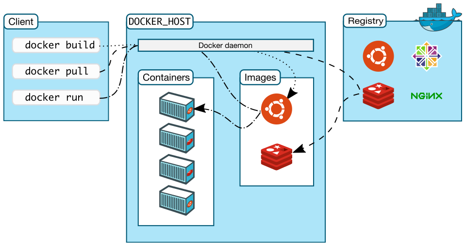
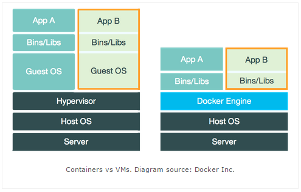

# Docker简介

## 1.1 Docker简介

Docker是一个开源的**容器引擎**，它可以帮助我们更快地交付应用。Docker可将应用程序和基础设施层隔离，并且能将基础设施当作程序一样进行管理。使用Docker，可更快地打包、测试以及部署应用程序，并可**减少从编写到部署运行代码的周期**。

**TIPS**

(1) Docker官方网站：<https://www.docker.com/>

(2) Docker GitHub：<https://github.com/docker/docker>


## 1.2 版本与迭代计划

近日，Docker发布了Docker 17.06。进入Docker 17时代后，Docker分成了两个版本：Docker EE和Docker CE，即：企业版(EE)和社区版(CE)。

### 1.2.1 版本区别

**Docker EE**（企业版）

Docker EE由公司支持，可在经过认证的操作系统和云提供商中使用，并可运行来自Docker Store的、经过认证的容器和插件。

Docker EE提供三个服务层次：

| 服务层级     | 功能                                       |
| -------- | ---------------------------------------- |
| Basic    | 包含用于认证基础设施的Docker平台<br>Docker公司的支持<br>经过 认证的、来自Docker Store的容器与插件 |
| Standard | 添加高级镜像与容器管理<br>LDAP/AD用户集成<br>基于角色的访问控制(Docker Datacenter) |
| Advanced | 添加Docker安全扫描<br>连续漏洞监控                   |

大家可在该页查看各个服务层次的价目：<https://www.docker.com/pricing> 。

**Docker CE**

Docker CE是免费的Docker产品的新名称，Docker CE包含了完整的Docker平台，非常适合开发人员和运维团队构建容器APP。事实上，Docker CE 17.03，可理解为Docker 1.13.1的Bug修复版本。因此，从Docker 1.13升级到Docker CE 17.03风险相对是较小的。

大家可前往Docker的RELEASE log查看详情<https://github.com/docker/docker/releases> 。

Docker公司认为，Docker CE和EE版本的推出为Docker的生命周期、可维护性以及可升级性带来了巨大的改进。

### 1.2.2 版本迭代计划

Docker从17.03开始，转向基于时间的`YY.MM` 形式的版本控制方案，类似于Canonical为Ubuntu所使用的版本控制方案。

Docker CE有两种版本：

edge版本每月发布一次，主要面向那些喜欢尝试新功能的用户。

stable版本每季度发布一次，适用于希望更加容易维护的用户（稳定版）。

edge版本只能在当前月份获得安全和错误修复。而stable版本在初始发布后四个月内接收关键错误修复和安全问题的修补程序。这样，Docker CE用户就有一个月的窗口期来切换版本到更新的版本。举个例子，Docker CE 17.03会维护到17年07月；而Docker CE 17.03的下个稳定版本是CE 17.06，这样，6-7月这个时间窗口，用户就可以用来切换版本了。

Docker EE和stable版本的版本号保持一致，每个Docker EE版本都享受**为期一年**的支持与维护期，在此期间接受安全与关键修正。


### 1.2.3 参考文档

ANNOUNCING DOCKER ENTERPRISE EDITION：<https://blog.docker.com/2017/03/docker-enterprise-edition/> 


## 1.3 Docker的发展历程

* 发展历程

| Docker版本         | Docker基于{}实现          |
| ---------------- | --------------------- |
| Docker 0.7之前     | 基于LXC                 |
| Docker0.9后       | 改用libcontainer        |
| **Docker 1.11后** | **改用runC和containerd** |

* 表格名词对应官网
  * LXC：<https://linuxcontainers.org/lxc/introduction/>
  * libcontainer：<https://github.com/docker/libcontainer>
  * runC：<https://github.com/opencontainers/runc>
  * containerd：<https://github.com/containerd/containerd> 
* 各名词之间的关系
  * [OCI](https://www.opencontainers.org/)：定义了容器运行的标准，该标准目前由[libcontainer](https://github.com/docker/libcontainer)和[appc](https://github.com/appc/spec)的项目负责人（maintainer）进行维护和制定，其规范文档作为一个项目在GitHub上维护。
  * runC（标准化容器执行引擎）：根据根据OCI规范编写的，生成和运行容器的CLI工具，是按照开放容器格式标准（OCF, Open Container Format）制定的一种具体实现。由libcontainer中迁移而来的，实现了容器启停、资源隔离等功能。
  * containerd：用于控制runC的守护进程，构建在OCI规范和runC之上。目前內建在Docker Engine中，参考文档：<https://blog.docker.com/2015/12/containerd-daemon-to-control-runc/> ，译文：<http://dockone.io/article/914>
* 浅谈发展历程
  - 时序：Docker大受欢迎 - 与CoreOS相爱相杀 - rkt诞生 - 各大厂商不爽 -  OCI制定（2015-06） - 成立CNCF（2015-07-21） - Kubernetes 1.0发布；
  - [CNCF](http://cncf.io)：云原生计算基金会，由谷歌联合发起，现隶属于Linux基金会。
* 拓展阅读
  * Docker背后的标准化容器执行引擎——runC：<http://www.infoq.com/cn/articles/docker-standard-container-execution-engine-runc> 
  * Docker、Containerd、RunC...：你应该知道的所有:<http://www.infoq.com/cn/news/2017/02/Docker-Containerd-RunC> 
  * Google宣布成立CNCF基金会，Kubernetes 1.0正式发布：<http://dockone.io/article/518> 


## 1.4 Docker快速入门

执行如下命令，即可启动一个Nginx容器

```shell
docker run -d -p 91:80 nginx
```


## 1.5 Docker架构

我们来看一下来自Docker官方文档的架构图，如图12-1所示。



图12-1 Docker架构图

我们来讲解图中包含的组件。

(1) Docker daemon（Docker守护进程）

Docker daemon是一个运行在宿主机（DOCKER_HOST）的后台进程。我们可通过Docker客户端与之通信。

(2) Client（Docker客户端）

Docker客户端是Docker的用户界面，它可以接受用户命令和配置标识，并与Docker daemon通信。图中，docker build等都是Docker的相关命令。

(3) Images（Docker镜像）

Docker镜像是一个只读模板，它包含创建Docker容器的说明。它和系统安装光盘有点像——我们使用系统安装光盘安装系统，同理，我们使用Docker镜像运行Docker镜像中的程序。

(4) Container（容器）

容器是镜像的可运行实例。镜像和容器的关系有点类似于面向对象中，类和对象的关系。我们可通过Docker API或者CLI命令来启停、移动、删除容器。

(5) Registry

Docker Registry是一个集中存储与分发镜像的服务。我们构建完Docker镜像后，就可在当前宿主机上运行。但如果想要在其他机器上运行这个镜像，我们就需要手动拷贝。此时，我们可借助Docker Registry来避免镜像的手动拷贝。

一个Docker Registry可包含多个Docker仓库；每个仓库可包含多个镜像标签；每个标签对应一个Docker镜像。这跟Maven的仓库有点类似，如果把Docker Registry比作Maven仓库的话，那么Docker仓库就可理解为某jar包的路径，而镜像标签则可理解为jar包的版本号。

Docker Registry可分为公有Docker Registry和私有Docker Registry。最常用的Docker Registry莫过于官方的Docker Hub，这也是默认的Docker Registry。Docker Hub上存放着大量优秀的镜像，我们可使用Docker命令下载并使用。


## 1.6 Docker与虚拟机



* Hypervisor层被Docker Engine取代。
  * Hypervisor：<https://baike.baidu.com/item/hypervisor/3353492> 
* 虚拟化粒度不同
  * 虚拟机利用Hypervisor虚拟化CPU、内存、IO设备等实现的，然后在其上运行完整的操作系统，再在该系统上运行所需的应用。资源隔离级别：OS级别
  * 运行在Docker容器中的应用直接运行于宿主机的内核，容器共享宿主机的内核，容器内部运行的是Linux副本，没有自己的内核，直接使用物理机的硬件资源，因此CPU/内存利用率上有一定优势。资源隔离级别：利用Linux内核本身支持的容器方式实现资源和环境隔离。
* 拓展阅读
  * 《Docker、LXC、Cgroup的结构关系》：<http://speakingbaicai.blog.51cto.com/5667326/1359825/>


## 1.7 Docker应用场景

* 八个Docker的真实应用场景：<http://dockone.io/article/126>