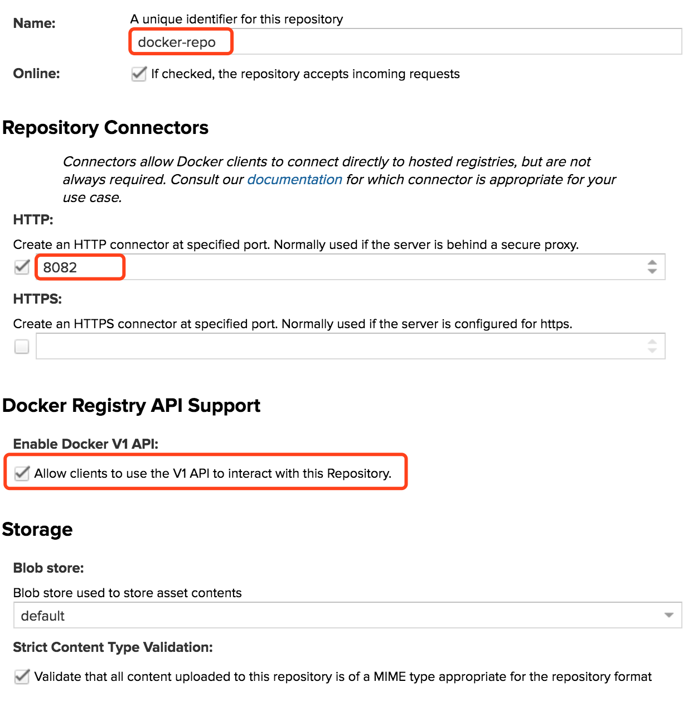

# 使用Nexus管理Docker镜像

## Nexus简介

Nexus是一个多功能的仓库管理器，是企业常用的私有仓库服务器软件。目前常被用来作为Maven私服、Docker私服。本文基于`Nexus 3.5.2-01` 版本进行讲解。


## Nexus下载

前往：<https://www.sonatype.com/download-oss-sonatype> ，根据操作系统，下载对应操作系统下的安装包即可。


## 安装

Nexus在不同系统中安装略有区别，但总体一致。下面以在Linux系统中的安装为例说明：

* 创建一个Linux用户，例如：nexus

  ```
  useradd nexus
  ```

* 解压Nexus安装包，为将解压后的文件设置权限，并修改属主为nexus用户

  ```shell
  chmod -R 755 *
  chown -R nexus:nexus *
  ```

* 将目录切换到`$NEXUS_HOME/nexus-3.5.2-01/bin` 目录

* 需改`nexus.rc` 文件，将其内容改为：

  ```Shell
  run_as_user="nexus"
  ```

  表示使用nexus用户启动Nexus。

* 如提示文件限制，可参考博文：<http://www.cnblogs.com/zengkefu/p/5649407.html> 进行修改。

* 执行如下命令，查看Nexus为我们提供哪些命令。

  ```
  ./nexus --help
  ```

  可显示类似如下的内容：

  ```
  Usage: ./nexus {start|stop|run|run-redirect|status|restart|force-reload}
  ```

* 指定如下命令，即可启动Nexus

  ```
  ./nexus start
  ```

  稍等片刻，Nexus即可成功启动。


## 账户

Nexus提供了默认的管理员账户，账号密码分别是admin/admin123。用户可自行修改该默认账号密码。


## 创建Docker仓库

* 访问<http://localhost:8081> 并登录
* 点击“Create repository”按钮，创建仓库。Nexus支持多种仓库类型，例如：maven、npm、docker等。本文创建一个docker仓库。一般来说，对于特定的仓库类型（例如docker），细分了三类，分别是proxy、hosted、group，含义如下：
  * hosted，本地代理仓库，通常我们会部署自己的构件到这一类型的仓库，可以push和pull。
  * proxy，代理的远程仓库，它们被用来代理远程的公共仓库，如maven中央仓库，只能pull。
  * group，仓库组，用来合并多个hosted/proxy仓库，通常我们配置maven依赖仓库组，只能pull。
* 本文创建一个**hosted**类型的仓库
* 配置仓库，如图，填入如下结果：
* 这样，仓库就创建完毕了。


## Docker配置

下面，我们需要为Docker指定使用Nexus仓库。

* 修改`/etc/docker/daemon.json` ，在其中添加类似如下的内容。

  ```
  {
    "insecure-registries" : [
      "192.168.1.101:8082"
    ]
    ...
  }
  ```

* 重启Docker


## 登录私有仓库

```shell
docker login 192.168.1.101:8082
```

即可登录私有仓库。然后，我们就可进行pull、push操作了。


## 容器启动Nexus

地址：<https://store.docker.com/community/images/sonatype/nexus3>

```shell
docker run -d -p 8081:8081  --name nexus sonatype/nexus3
```

为启动的容器映射端口：<http://blog.csdn.net/github_29237033/article/details/46632647>

